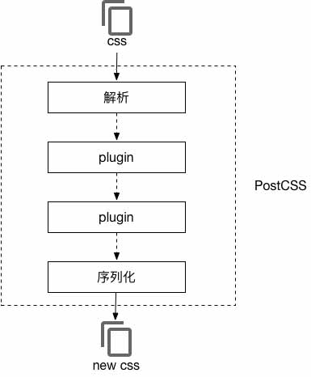

# 使用PostCSS解决浏览器兼容问题

### CSS的缺陷
CSS全称叫层叠样式表，当今web开发为了追求极致用户体验，对CSS的要求也不断增强。
受限于浏览器的实现以及CSS自身的弱编程能力，复杂CSS开发成为前端程序猿一件痛苦的事。

1. 各大浏览器实现不一
2. CSS的弱编程能力

### CSS预编译器

CSS预编译器几乎成为现如今开发CSS的标配，它从以下几个方面提升了CSS开发的效率：

- 增强编程能力
- 增强可复用性
- 增强可维护性
- 更便于解决浏览器兼容性

不同的预编译器特性虽然有所差异，但核心功能均围绕这些目标打造，比如：

- 嵌套：所有预编译器都支持的语法特性，也是原生CSS最让开发者头疼的问题之一
- 变量和运算：增强了源码的可编程能力
- mixin/继承：mixin/继承是为了解决hack和代码复用
- 模块化：更利于代码复用，同时也提高了源码的可维护性

### PostCSS

我们可以使用规范的CSS原生语法编写源代码，然后配置编译器需要兼容的浏览器版本，最后经过编译将源码转化为目标浏览器可用的CSS代码
#### 编译流程
<p align="center">
  
</p>
<hr>

#### 通过Webpack的postcss-loader实现CSS的构建

首先我们在package.json中添加以下依赖，我会在后面解释每个依赖所起的作用

```javascript
...
"devDependencies": {
  "autoprefixer": "^6.5.3",
  "css-loader": "^0.26.0",
  "style-loader": "^0.13.1",
  "postcss": "^5.0.3",
  "postcss-atroot": "^0.1.3",
  "postcss-calc": "^5.3.1",
  "postcss-color-function": "^2.0.1",
  "postcss-custom-media": "^5.0.1",
  "postcss-custom-selectors": "^3.0.0",
  "postcss-extend": "^1.0.5",
  "postcss-flexbugs-fixes": "^2.0.0",
  "postcss-import": "8.1.3",
  "postcss-loader": "^1.1.1",
  "postcss-media-minmax": "^2.1.2",
  "postcss-mixins": "^5.4.0",
  "postcss-nested": "^1.0.0",
  "postcss-property-lookup": "^1.2.1",
  "postcss-selector-matches": "^2.0.5",
  "postcss-selector-not": "^2.0.0",
  "postcss-simple-vars": "^3.0.0",
  "postcss-url": "^5.0.0",
  "extract-text-webpack-plugin": "^1.0.1",
  ...
}
...
```

然后我们在webpack.config.js中配置loader

```javascript
const ExtractTextPlugin = require('extract-text-webpack-plugin');
...
module: {
  // 如果是webpack v2以上版本，请将 loaders 换成 rules
  loaders: [
    {
      test: /\.s?css$/,
      // 这里的写法注意下
      loader: ExtractTextPlugin.extract('style-loader', 'css-loader!postcss-loader?-autoprefixer'),
      exclude: /node_modules/,
    },
    ...
  ]
},
plugins: [
  ...
  // 这里我们使用 ExtractTextPlugin 将编译后的css文件独立导出
  // 然后使用 allChunks:true 将所有的CSS文件合并成1个文件
  // 并指定在 dev 环境下不用此插件，方便调试
  new ExtractTextPlugin('[name].[contenthash:8].css', {
    allChunks: true,
    disable: isDev,
  }),
  ...
],
postcss(webpack) {
  return [
    require('postcss-import')({
      addDependencyTo: webpack,
    }),
    require('postcss-mixins')(),
    require('postcss-simple-vars')(),
    require('postcss-custom-selectors')(),
    require('postcss-custom-media')(),
    require('postcss-media-minmax')(),
    require('postcss-color-function')(),
    require('postcss-property-lookup')(),
    require('postcss-calc')(),
    require('postcss-nested')(),
    require('postcss-atroot')(),
    require('postcss-extend')(),
    require('postcss-selector-matches')(),
    require('postcss-selector-not')(),
    // Postcss flexbox bug fixer
    // https://github.com/luisrudge/postcss-flexbugs-fixes
    require('postcss-flexbugs-fixes')(),
    // PreCSS - End
    // 当然，我我们还可以使用 cssnext 书写未来的 CSS
    // 参考：https://www.npmjs.com/package/postcss-loader
    require('autoprefixer')({
      browsers: ['> 1% in CN', 'last 2 versions'],
    }),
  ];
},
...
```

#### 各依赖的作用

- autoprefixer：处理CSS前缀问题的神器，属性源自:[Can I Use](https://caniuse.com/)
- css-loader：解析css源文件并获取其引用的资源，比如@import引用的模块、url()引用的图片等
- style-loader：负责将css代码通过`<style>`标签插入html文档中，所以如果独立导出css文件就不再需要style-loader
- postcss-import：在css文件中使用@import引入其他样式文件，但是使用autoprefixer发现，import进来的样式没有处理，[参考这里](https://github.com/zhengweikeng/blog/issues/9)
- postcss-mixins：自定义一段代码，后面可以用@include调用，注意，这个插件必须运行在postcss-nested和postcss-simple-vars插件之后
- postcss-simple-vars：类似Sass参数语法
- postcss-custom-selectors：实现 [W3C CSS Extensions(Custom Selectors) ](http://dev.w3.org/csswg/css-extensions/#custom-selectors)
- postcss-custom-实现 [W3C CSS Custom Media Queries syntax](https://drafts.csswg.org/mediaqueries-5/#custom-mq)
- postcss-media-minmax：用更加直观的 >=或<= 替代 media queries 中的 min-/max- 前缀
- postcss-color-function：实现 [W3C CSS color function](https://drafts.csswg.org/css-color/#modifying-colors)
- postcss-property-lookup：允许你查找一个属性的值，并且传递给另一个属性
- postcss-calc：帮助我们使用想要的数学表达式
- postcss-nested：嵌套css，提高可阅读性
- postcss-atroot：将css规则放到根节点
- postcss-extend：方便使用规则继承
- postcss-selector-matches：实现 [W3C CSS :matches() 选择器](https://css-tricks.com/almanac/selectors/m/matches/)
- postcss-selector-not：实现将 [W3C CSS level 4 的 :not() 转换成 level 3 选择器](http://dev.w3.org/csswg/selectors-4/#negation)


<p style="color: red">注：webpack的loader的配置是从右往左的，css-loader必须在style-loader之前执行。</p>