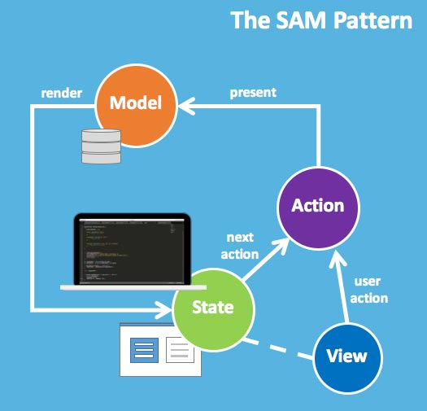
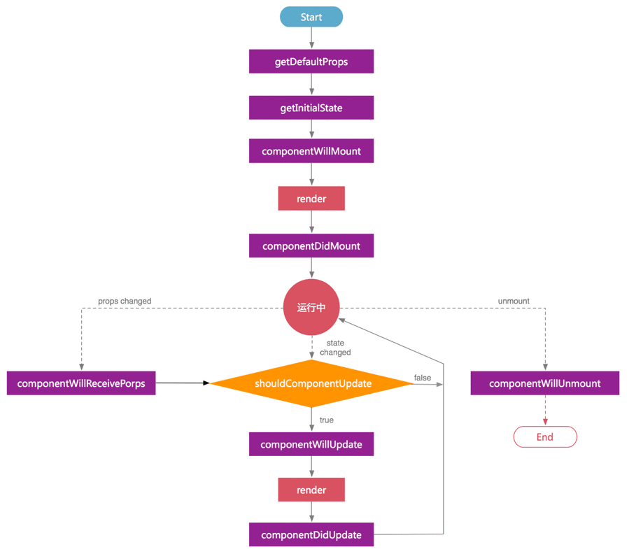
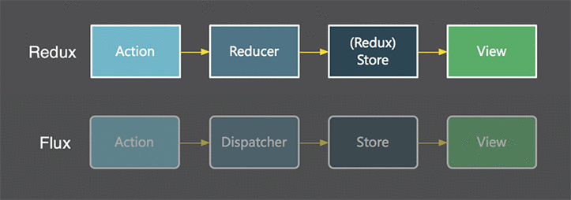
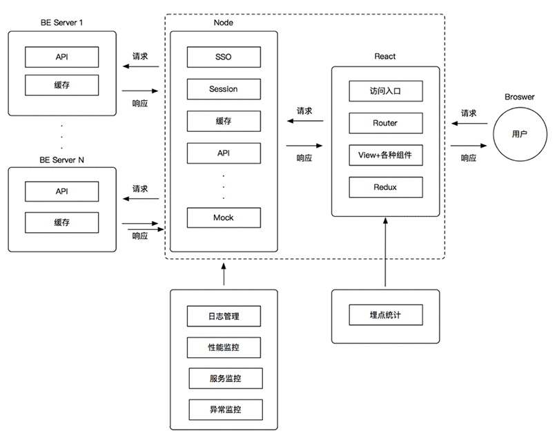

# React生态系统：从小白到大神

## 引言
要了解React的思想，还得从下面这张图说起。

    

The State-Action-Model (SAM) Pattern

话说2016年2月的一篇文章no-more-mvc-frameworks描述了一种新的函数式、响应式模型，而它的思想来源正是来自React和TLA+，这一模型就叫做SAM模型。
SAM模型让前端开发人员更专注于从模型中去建立视图，而不会受牵制于基础API。因此SAM完全符合软件架构的重要设计原则。这种模型的最佳实践莫过于React与Angular了，随着他们的发展，前端架构思想开始了转变。
虽然React官网将React定位为创建用户界面的JS库，但我想说的是，“React is just the View in MVC”这一说法太过委婉了。React所带来的是整个前端技术栈的进化，各种函数响应式框架逐渐在完善。随着React的发展和流行，围绕着React的生态系统已经逐渐形成。而从React小白到大神，必须要经历三个境界，但总归起来就五个字：“就解问题嘛”——出自“阿里扫地僧”多隆。因此，本文均通过每个知识点解决了哪些问题来进行阐述。

## 1 React庞大的体系

### 1.1 ReactJS
ReactJS到底解决了哪些问题呢？先来一份总结的ReactJS特点：
* 高效 −React通过虚拟DOM和Diff算法，最大限度地减少与DOM的交互和渲染。——提高运行效率
* 组件化 − 通过 React 构建组件，使得代码更加容易复用，适应大型项目开发。——提高可维护性和复用性以及开发效率
* 模块化 − 通过模块化工具库来解决模块化问题——提高可维护性和复用性
* 单向数据流 − React 实现了单向响应的数据流，从而减少了重复代码，这也是它为什么比传统数据绑定更简单。——提高可维护性
一言以蔽之，ReactJS解决了前端技术规划中应该考虑的这几件事：组件化、模块化、开发效率、运行效率、可维护性…
 
### 1.2 React生命周期

下图很直观地描述了React生命周期的整个过程：

    

本图参考bailicangdu的github项目：react-pxq，在此表示感谢。这是一个很好的react + redux项目，其中渗透出了作者对react的理解，能很好的帮助大家快速上手react。

### 1.3 React Router
React Router是 React 中使用的路由库，通过管理URL来管理组件及对应的状态。Router组件本身只是一个容器，真正的路由要通过Route组件定义。Route组件支持嵌套路由、支持通配符，能让你轻松控制整个项目的路由结构。

### 1.4 Redux
Redux跟React没有直接的关系，本身可以支持React、Angular、Ember等等框架。Redux其实是Flux-like 更优雅的写法，下图对比了Flux与Redux的数据流向：

    

通过react-redux这个库，可以方便的将react和redux结合起来：React负责页面展现，Redux负责维护/更新数据状态。大致过程为：当用户在View中触发事件产生Action，Action 进到 Reducer，Reducer根据Action Type去匹配对应处理的动作，然后返回一个新的状态。View则因为检测到状态更新而进行重绘。Redux只有一个Store负责存放整个App的状态，而唯一能改变状态的方法只有发送Action。Redux社区中使用比较多的库有：redux-sagas、redux-gen、redux-loop、redux-effects、redux-side-effects、redux-thunks、rx-redux、redux-rx...

### 1.5 React测试
目前广大开发者偏向使用Airbnb 团队开发的 enzyme，它也可以与其他测试工具如Jest、Mocha等配合使用，比如我们使用jest-enzyme，由于Jest是Facebook开发并且是在Jasmine测试框架上演变而来的，断言格式我们比较熟悉，因此大家可能更容易上手。Jest的目标是减少测试一个项目所要花费的时间和认知负荷，总的来说就是让测试变得更简单。因此它提供了大部分我们需要的现成工具：快速的命令行接口、Mock工具集以及它的自动模块Mock系统。
 
### 1.6 React Native
RN是在Facebook所提出的核心概念Learn once, write anywhere所诞生的产物，着力于提高多平台开发的开发效率。我们可以同时为android和ios两个平台开发App，只需要根据两个平台不一样的地方去做一些调整即可。RN主要负责UI部分，而原生主要负责交互和数据处理。RN属于hybrid开发，并且与原生无缝连接，相比Web App和Native开发，RN取长补短，集合了两者的优势。学习RN可以跟着git上的awesome系列去进阶。

**`做React还需要懂什么？`**
### 1.7 Node
Node打破了过去JS只能在浏览器中运行的局面。前后端编程环境的统一，大大降低了前后端转换所需要的上下文交换代价。Node就是浏览器在协议栈另一边的倒影，虽然不处理UI，却与浏览器有着相同的机制和运行原理。其高性能并行I/O使得分布式开发更加高效，利用稳定接口可提升web渲染速度，也十分适合做实时应用开发。
 
### 1.8 NPM与Yarn
我们知道Node的包描述文件是一个JSON文件，用于描述非代码相关的信息。而NPM则是一个根据包规范来提供Node服务的Node包管理器。它解决了依赖包安装的问题，却面临着两个新的问题：
* 安装的时候无法保证速度/一致性
* 安全问题，因为 npm 安装时允许运行代码

于是Yarn就出现了，不要慌，它并没有试图完全取代 npm，不过Yarn确实也是可以完美替代npm的。
 
### 1.9 模块化开发
随着web应用的发展，前端的业务逻辑越来越复杂，代码也越来越多，各种问题就暴露出来了：全局变量污染、函数命名冲突、依赖关系混乱等问题严重阻碍了前端开发的发展，js模块化势在必行。通过开发者不断地尝试，出现了各种规范和实践：
#### 1.9.1 CommonJS
Node.JS首先采用了js模块化的概念。Node.js 服务器端通过exports、module.exports来输出模块，并使用require同步载入模块，而浏览器端的可以使用Browserify实现。
 
#### 1.9.2 AMD
AMD规范用于异步加载模块，主要用于浏览器端，当然也支持其他js环境，主要应用有requireJS。
 
#### 1.9.3 ES6 Module
ES6标准定义了JS的模块化方式，目的是取代 CommonJS 、AMD、CMD等规范，一统江湖，成为通用的模块化解决方案。但浏览器和Node端对ES6的支持度还不是很高，需要用Babel进行转译（Babel 编译器可以将 ES6 、JSX 等代码转换成浏览器可以看得懂的语法）。
 
#### 1.9.4 Gulp/Grunt+Webpack/Browserify
在构建前端项目资源，使用自动化工具协助进行自动化程序码打包、转译等重复性工作，可以大幅提升开发效率。
##### 1.9.4.1 Gulp
Gulp和Grunt一样是一种基于任务的构建工具，能够优化前端工作流程。
##### 1.9.4.2 Webpack
webpack傻瓜式的项目构建方式解决了模块化开发和静态文件处理两大问题。但随着项目越来越大，特定需求的出现就使得webpack越来越难配置了。因此webpack在没太多特定需求的项目使用是没有问题的，当然，webpack的未来肯定是围绕ES的支持度、构建速度与产出代码的性能和用户体验来建设的。其未来的重要关注点：
* 高性能的构建缓存
* 提升初始化速度和增量构建效率
* 更好的支持Type Script
* 修订长期缓存
* 支持WASM 模块支持
* 提升用户体验
##### 1.9.4.3 Browserify
Browserify是基于Unix小工具协作的方式实现模块化方案的，轻便且配置容易，管道形式的组织则让开发者很容易插拔或修改其中某一环节的操作。 
至于怎么配合使用，我觉得仁者见仁智者见智，确实是不好下定论，只有亲身体验才能择更好者而用吧。
 
##### 1.9.4.4 ES2015/ES6
我们都知道ECMASCRIPT是组成JS的三要素之一，通过ES6最常用的特性，我们来了解ES6到底解决了什么：

- let, const（变量类型） − 解决变量作用域泄露的问题
- Class, extends, super（类、继承） − 让对象原型的写法更加清晰、更像面向对象编程的语法，也更加通俗易懂
- Arrow functions（箭头函数） − 1.简洁、简洁、简洁，2.解决this绑定的问题（继承外面的this）
- Template string（模板字符串） − 解决传统写法非常麻烦的问题
- Destructuring（解构） − 避免让API使用者记住多个参数的使用顺序
- Default, rest（默认值、参数） − 简化，替代arguments，使代码更易于阅读
 
#### 1.9.5 ImmutableJS
我们知道在 JavaScript 中有两种数据类型：基础数据类型和引用类型。在 JavaScript 中的对象数据是可以变的，由于使用了引用，所以修改了复制的值也会相应地修改原始值。通常我们用 deepCopy 来避免修改，但这样做法会产生资源浪费。而ImmutableJS的出现很好的解决了这一问题。
 
另外，推荐大家从git上的awesome系列去学习你想要学习的一门知识。
 
 
## 2 前后端架构分离

    

前后端分离的分层架构图

很多人都有过MVC架构的开发经验，从spring mvc开始，写JSP，再到使用freemarker，然后再到狭义的前后端分离，也就是Web端通过ajax调用接口，使用JS把数据渲染到页面上。以前后端人员套页面，数据结构和业务逻辑混淆在一起，项目越来越大后，维护起来特别的繁琐。目前看到的前后端分离项目都是上图所示这种形式去实现的。尤其是在大公司，基本都是采用面向服务架构的开发模式，团队开发中的沟通成本以及职责明确特别重要。而前后端分离的意义主要在于解耦，解耦后前后端职责划分更明确，前端能做的事也越来越多，比如我们可以在Node层做些监控和日志管理，将SSO登录集成进Node层，使用PM2对Node做多进程管理。这样之后，后端项目就可以做成"微服务"式的架构。
 
从前端项目工程化管理的角度来看，后端项目"微服务"式架构有如下优势：
* 每个项目都很有针对性，仅关注某个业务方向
* 每个项目可由不同团队独立开发，互不影响，能快速响应需求、及时推出市场；
* 允许在频繁发布不同项目的同时保持系统其他部分的可用性和稳定性：依赖少、构建速度快 & 上线速度快。

前端只与Node中间层进行数据通信，Node层则通过thrift接口与后端服务进行数据通信；Node 中间层的 API 设计遵循 RESTFul 的架构风格，并且都以 /api/*** 做为前缀；Node 中间层可以视情况添加缓存服务
 
## 3 前端工程化
现代化的前端开发已经不仅仅是业务代码本身，而是涉及了很多方面的需求，比如：开发需求、共享需求、性能需求、部署需求。
 
### 3.1 开发需求
在开始一个前端项目时，我们会先进行技术选型，然后定义代码规范，再根据业务模块拆分进行项目目录规划，这些相关的需求都算作前端开发需求。
 
#### 3.1.1 代码规范
ESLint是一个用来识别 ECMAScript 并且按照规则给出报告的代码检测工具，使用它可以避免低级错误和统一代码的风格。我们可以方便的在配置文件中配置自己想要的风格规范，通常推荐使用Airbnb JavaScript或者google的规范。
 
#### 3.1.2 CSS预处理
我们可以使用less或sass来优化css的开发过程，而如果考虑到浏览器兼容性的hack问题，我们可以用postcss作为预处理工具帮我们自动解决这些 hack。
 
#### 3.1.3 热更新
hmr能够在感知你的代码有变动的情况下自动调用编译工具编译源码，然后通过 livereload 自动刷新浏览器，这样做的话能节省你的调试时间。
 
#### 3.1.4 Mock
由于采用了前后端分离的开发模式，在真实开发中，为了让前端开发不受后端进度的影响，我们需要对数据进行mock。前后端先约定API 接口定义，然后前端根据定义mock 接口。一般大公司会有自己的mock平台，小公司如果没有的话也可以使用开源的mock工具。
 
#### 3.2 共享需求
对于公司而言，快速高效地实现业务是终极目标，这对前后端来说都是挑战。在前端团队中，能够形成基础组件库和业务组件库是一种必然需求。
所以在设计前端项目架构的时候，一定要考虑业务的组件化和可共享性。
* 基础代码共享
* 通用工具方法共享
* 基础交互组件共享
* 业务组件共享

React 提供了天然的组件结构，我们只需要在开发过程中，隐藏组件的内部实现，每个组件更独立，很容易形成可重用组件。
 
### 3.3 性能需求
如何对web资源的加载速度进行优化呢？
* Javascript, Css 代码压缩
* Javascript, Css 代码合并
* 图片压缩
* Css 图片精灵或雪碧图（css sprit）

这些过程都可以在前端工程的构建过程中使用Grunt/Gulp、webpack等构建工具实现。
 
### 3.4 部署需求
前端工程通常是由多人维护的，所以会用代码管理工具来管理源码，然后将开发流程和部署流程与git结合起来。多人分支协作流程：用git flow来管理代码分支。
 
## 4 总结
实践证明，围绕着React所建立起来的生态系统以及组件化开发思想能有效地分解大规模应用的复杂度、提高资源复用率。简单的说，React拥有以下你想要的特性：
* 同构渲染：服务器端和客户端共用一套代码，一份模板，两端使用；
* 完全组件化：自动分析加载页面的静态资源依赖；
* 生态圈：畅享所有 React 组件。

当然，使用React也有一些缺点，例如页面 javascript 文件体积动辄上百KB，这就限制了在移动端项目上的使用。我们可以通过一些离线化方案，例如使用 LocalStorage 缓存等来尽量的减少对大体积静态资源的请求。